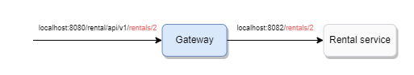

# Simona Immobilier

Par :

- CHEN Xing
- DESPRES Antoine
- ARNOULT Aymeric
- BRAL Laurie
- DANG Mélanie
- EA Jean-Jacques

Le 11/04/2023

## Objectif

L'objectif est de créer une application de location de logement basée sur l’architecture des microservices. L'application doit être facile à utiliser et offrir une expérience fluide pour les locataires et les propriétaires.

## Fonctionnalités implémentées

- opérations CRUD sur les logements
- opérations CRUD sur les locations
- l'authentification par Json Web Token (JWT)
- documentation Swagger
- déploiement par Docker

## Usage

Exécuter le projet avec Docker :

```bash
docker-compose up
```

Vous retrouverez le swagger à l'adresse : http://localhost:8080/swagger-ui.html

Vous pouvez visionner toutes les instances de microservice ici: http://localhost:8761

## Dépendances

| Nom                                                                                  | Description                                                                                                          |
| ------------------------------------------------------------------------------------ | -------------------------------------------------------------------------------------------------------------------- |
| Spring Boot 2.7.10                                                                   | Framework Java qui permet de développer rapidement des applications Web et des microservices.                        |
| [Spring Cloud Gateway](https://cloud.spring.io/spring-cloud-gateway/reference/html/) | Une API Gateway qui se construit sur l'écosystème Spring, à savoir Spring 5, Spring boot 2 et Projet Reactor.        |
| Eureka                                                                               | mettre en place un registre content toutes les instances de chaque microservice déployé dans des serveurs différents |
| Feign                                                                                | permet aux microservices de communiquer entre-eux en faisant des requêtes REST                                       |
| PostgreSQL                                                                           | base de données SQL                                                                                                  |

## Description des microservices

L'application est découpé en 4 microservices dont 1 API Gateway :

- API Gateway
- Auth service
- Housing service
- Rental service

Je vais vous détaillé les services un par un dans la partie qui suit.

**Notes**

- Chaque service a sa propre base de données PostgreSQL respective : `simona_account_service`, `simona_housing_service`, `simona_rental_service`.

- Chaque service communique à l'aide de la bibliothèque Feign, un client REST déclaratif.

## Vue d'ensemble d'interaction entre les microservices

Exemple : recevoir les informations d'un logement.


### API Gateway

C'est le point d'entrée du système. Il permet de diriger les requêtes vers les microservices correspondants. Il peut également faire office de la gestion d'authentification.

Nous avons choisi d'utiliser la bibliothèque [Spring Cloud Gateway](https://cloud.spring.io/spring-cloud-gateway/reference/html/) car elle est présent dans l'écosystème de Spring.

La configuration de l'acheminement des routes API se trouve dans `application.yml`:

```yml
# application.yml

spring:
  config:
    import: 'optional:configserver:'
  application:
    name: gateway
  cloud:
    gateway:
      discovery:
        locator:
          enabled: true
      routes:
        - id: rental-service
          uri: lb://rental-service
          predicates:
            - Path=/rental/api/v1/**
          filters:
            - AuthFilter
            - RewritePath=/rental/api/v1/(?<segment>.*), /$\{segment}
```

`routes`: définir les routes à acheminer

`routes.id`: définir l'id du service vers lequel Gateway achemine les requêtes

`routes.uri`: définir son uri. `lb` est précisé afin d'utiliser un load balancer pour répartir les requêtes.

`routes.predicates`: un prédicat permet de tester si une requête vérifie une condition. `Path` indique que le chemin de la requête doit commencer par `/rental/api/v1`. Concrètement, lorsqu'on fait une requête à l'url `/rental/api/v1`, le Gateway va acheminer la requête vers le service de location.

`routes.filter`: un filtre permet de faire des modifications sur la requête. `AuthFilter` est un filtre d'authentification. Il va vérifier s'il y a la présence d'un token dans l'en-tête `Authorization`.

`RewritePath` permet de réécrire le chemin. En réalité l'endpoint exposé par rental-service est `localhost:8083/rentals/*`.

Considérons que nous souhaitons recevoir le logement 2 avec `localhost:8080/rental/api/v1/rentals/1`:



`Rental-service` expose l'endpoint`localhost:8083/rentals/{id}`. Ce qui implique que Gateway doit faire une requête à ledit endpoint. `RewritePath` indique que Gateway va récupérer le segment `rentals/2` et fait une requête à rental-service avec l'endpoint `localhost:8083/rentals/2`.

En réalité, `RewritePath` permet d'ajouter un préfixe afin de **versionner** l'API de rental-service. Nous pouvons très bien laisser l'endpoint `/rentals` sans réécrire le chemin.

```yml
routes:
  - id: rental-service
    uri: lb://rental-service
    predicates:
      - Path=/rentals/**
    filters:
      - AuthFilter
```


### Auth service

Ce service est responsable de la gestion des utilisateurs. Il permet de créer un compte, de se connecter, de se déconnecter et de valider.

Nous avons utilisé [Spring Boot Security](https://docs.spring.io/spring-security/reference/index.html) pour la gestion de l'authentification. Spring Boot Security est un framework qui permet de gérer l'authentification et l'autorisation. Elle est basée sur Spring Security.

Au moment de se connecter avec `/login`, le méthode suivante est exécutée afin de hash le mot de passe et de le stocker :

```java
// AccountService.java

public Account saveAccount(Account credential) {
  if (accountRepository.findByEmail(credential.getEmail()).isPresent()) {
    throw new RuntimeException("Email already exists");
  }
  credential.setPassword(passwordEncoder.encode(credential.getPassword()));
    return accountRepository.save(credential);
}
```

La méthode utilise `passwordEncoder` qui est une instance de `BCryptPasswordEncoder` pour hash le mot de passe.

`BCryptPasswordEncoder` est une implémentation de l'algorithme de hash BCrypt.

### Housing service

Ce service est responsable de la gestion des logements. Il permet de créer un logement, de le modifier et de le récupérer.

### Rental service

Ce service est responsable de la gestion des locations. Il permet de créer une location, de la modifier et de la récupérer.

## Gestion des interactions entre les services

Feign est un client REST déclaratif. Il permet d'écrire des requêtes REST en utilisant des interfaces Java.

Reprenons l'exemple de la lecture d'un logement vu dans la partie [précédente](#vue-d'ensemble-d'interaction-entre-les-microservices).

Afin d'appeler le rental service depuis le housing service, nous avons créé une interface `RentalServiceClient` dans le housing service:

Housing service :

```java
// RentalClient.java

@FeignClient(name = "rental-service", url = "${gateway.url}/rental/api/v1")
public interface RentalClient {
    @GetMapping("/rentals/housing/{housingId}")
    ApiResponse<List<RentalDto>> getRentalsByHousingId(@RequestHeader("Authorization") String authorization, @PathVariable Long housingId);
}
```

`url` est l'url du gateway, car il est responsable d'acheminer les requêtes vers les services appropriés.

Nous appelons rental service avec le client Feign `RentalClient` :

```java
// HousingController.java

@GetMapping("/housings/{id}")
public ResponseEntity<ApiResponse<HousingDto>> findById(@PathVariable Long id, @RequestHeader(required = false, value = HttpHeaders.AUTHORIZATION) String authorization) {

  Optional<Housing> foundHousing = housingRepository.findById(id);
  if (foundHousing.isEmpty())
      return ResponseEntity.notFound().build();

  ApiResponse<List<RentalDto>> rentalResponse = rentalClient.getRentalsByHousingId(authorization, id); // <-- appel de rental service

  return ResponseEntity.ok(new ApiResponse<>(new HousingDto(foundHousing.get(), rentalResponse.getData()), ""));
}
```

## Gestion de l'authentification

Afin de sécuriser notre API, nous utilisons JSON Web Token (JWT), un standard ouvert ([RFC 7519](https://www.rfc-editor.org/rfc/rfc7519)) qui définit que l'échange d'informations entre deux parties peut être sécurisé et vérifié grâce à un token ayant une date d'expiration.

Nous avons utilisé la bibliothèque Maven [JJWT API](https://mvnrepository.com/artifact/io.jsonwebtoken/jjwt-api).

### 1. Génération du token

Nous avons créer une méthode `generateToken()` dans `Authservice` qui permet de générer le token à partir du nom d'utilisateur:

```java
// AuthService.java
j
public String generateToken(String username) {
    return jwtUtil.generateToken(username);
}
```

Nous l'appelons dans `AccountController` dans la route `/login`:

```java
@PostMapping("/login")
public String login(@RequestBody AuthRequest authRequest) {
    Authentication authenticate = authenticationManager.authenticate(new UsernamePasswordAuthenticationToken(authRequest.getEmail(), authRequest.getPassword()));

    if (authenticate.isAuthenticated()) {
        return authService.generateToken(authRequest.getEmail()); // <-- appel de la méthode generateToken()
    } else {
        throw new RuntimeException("invalid access");
    }
}
```

### 2. Validation du token

## Gestion de déploiement

Docker est un logiciel libre qui permet de créer, déployer et exécuter des applications dans des conteneurs logiciels.

Nous avons utilisé Docker d'afin de nous épargner de l'installation de JDK Java, Maven, PostgreSQL et autres dépendances sur le serveur.

Nous avons créer une image pour chaque service qui build le projet et le packager dans un fichier jar.

Exemple de `Dockerfile` de Auth service:

```dockerfile
FROM maven:3.8.3-jdk-11-slim
WORKDIR /app
COPY pom.xml .
# Resolve everything this project is dependent on
RUN mvn dependency:go-offline
COPY src/ ./src/
# Skip database localhost test
RUN mvn clean package -Dmaven.test.skip=true

FROM openjdk:11-jre-slim
# Copy just the built maven package from the previous stage into this new stage.
COPY --from=0 /app/target/auth-service-0.0.1-SNAPSHOT.jar /app.jar
EXPOSE 8081
ENTRYPOINT ["java", "-jar", "/app.jar"]
```

Nous avons utilisé Docker compose afin de déployer plusieurs conteneurs Docker en même temps. La configuration est définie dans `docker-compose.yml`.
