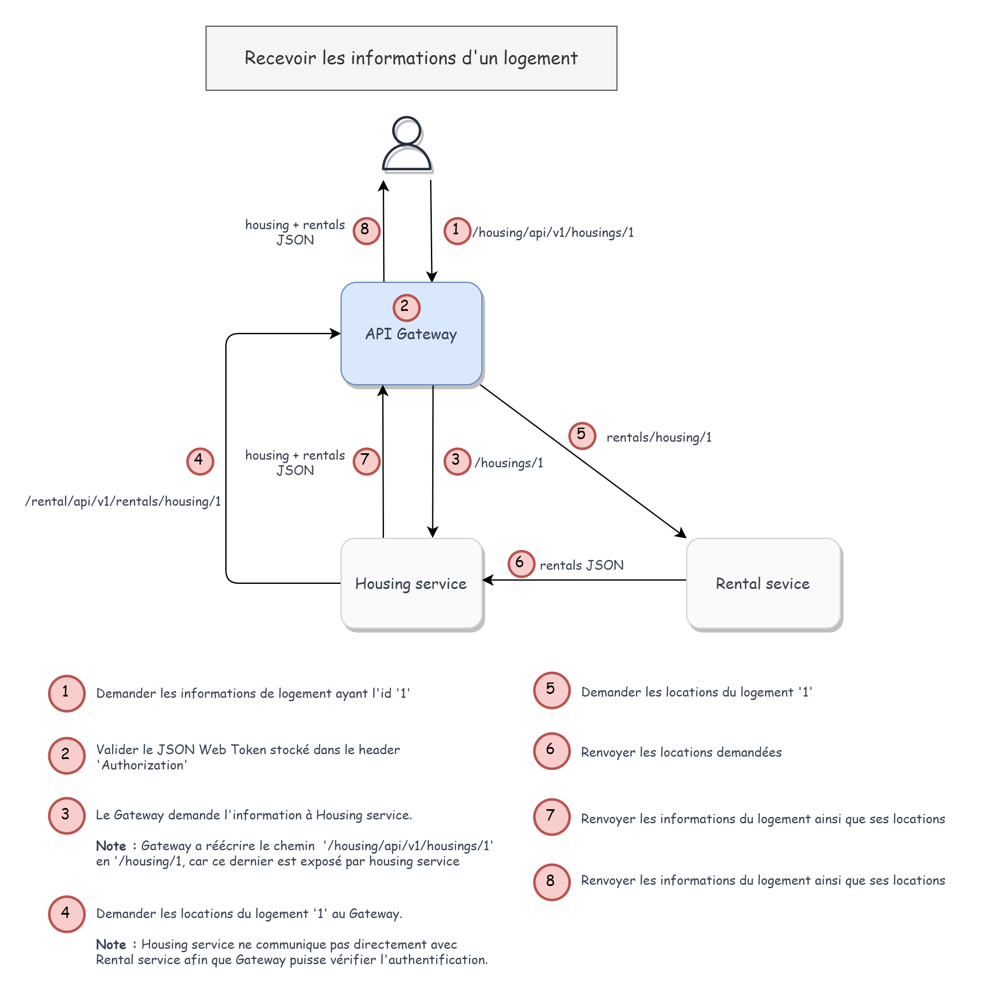
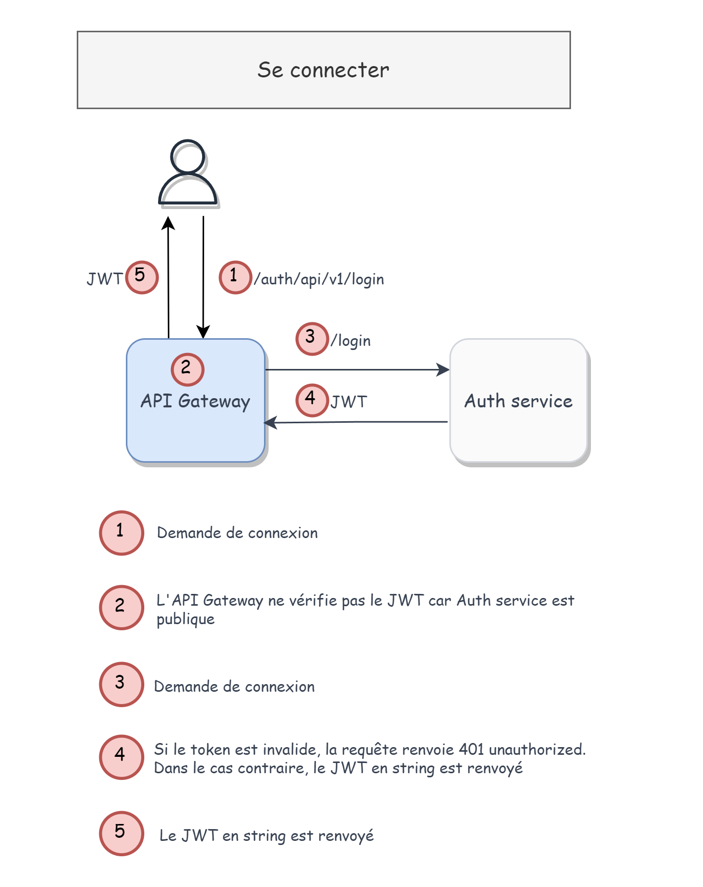
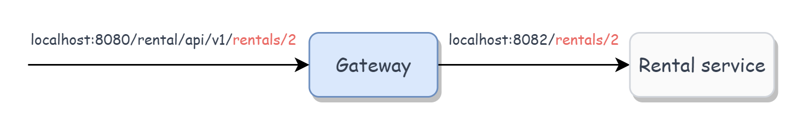

# Simona Immobilier

Par :

- CHEN Xing
- DESPRES Antoine
- ARNOULT Aymeric
- BRAL Laurie
- DANG Mélanie
- EA Jean-Jacques

Le 11/04/2023

## Objectif

L'objectif est de créer une application de location de logement basée sur l’architecture microservices. L'application doit être facile à utiliser et offrir une expérience fluide pour les locataires et les propriétaires.

## Fonctionnalités implémentées

- opérations CRUD sur les logements
- opérations CRUD sur les locations
- l'authentification par JSON Web Token (JWT)
- documentation Swagger
- déploiement par Docker

## Usage

Exécuter le projet avec Docker :

```bash
docker-compose up
```

Vous retrouverez le swagger à l'adresse : http://localhost:8080/swagger-ui.html

Vous pouvez visionner toutes les instances de microservice ici: http://localhost:8761

## Dépendances

| Nom                                                                                  | Description                                                                                                                          |
| ------------------------------------------------------------------------------------ |--------------------------------------------------------------------------------------------------------------------------------------|
| [Spring Boot 2.7.10](https://spring.io/)                                             | Framework Java qui permet de développer rapidement des applications Web et des microservices.                                        |
| [Spring Cloud Gateway](https://cloud.spring.io/spring-cloud-gateway/reference/html/) | Une API Gateway qui se construit sur l'écosystème Spring, à savoir Spring 5, Spring boot 2 et Projet Reactor.                        |
| [Eureka](https://cloud.spring.io/spring-cloud-netflix/reference/html/)               | Bibliothèque mettant en place un registre contenant toutes les instances de chaque microservice déployé dans des serveurs différents |
| [Feign](https://github.com/OpenFeign/feign)                                          | Un client REST déclaratif permettant aux microservices de communiquer entre-eux en faisant des requêtes REST                         |
| [PostgreSQL](https://www.postgresql.org/)                                            | La base de données relationnelle Open Source la plus avancée au monde                                                                |

## Description des microservices

L'application est découpée en 4 microservices dont 1 API Gateway :

- API Gateway
- Auth service
- Housing service
- Rental service

Le contenu des sercices sera détaillé dans la partie suivante du présent rapport.

**Notes**

- Chaque service a sa propre base de données PostgreSQL respective : `simona_account_service`, `simona_housing_service`, `simona_rental_service`.

- Chaque service communique à l'aide de Feign.

## Vue d'ensemble des interactions entre les microservices

Exemple 1 : recevoir les informations d'un logement.



Exemple 2 : se connecter



### API Gateway

C'est le point d'entrée du système. Il permet d'acheminer les requêtes vers les microservices correspondants. Il peut également jouer le rôle de gestionnaire d'authentification.

Nous avons choisi d'utiliser la bibliothèque [Spring Cloud Gateway](https://cloud.spring.io/spring-cloud-gateway/reference/html/) car elle fait partie de l'écosystème de Spring.

La configuration de l'acheminement des routes API se trouve dans `application.yml`:

```yml
# application.yml

spring:
  config:
    import: 'optional:configserver:'
  application:
    name: gateway
  cloud:
    gateway:
      discovery:
        locator:
          enabled: true
      routes:
        - id: rental-service
          uri: lb://rental-service
          predicates:
            - Path=/rental/api/v1/**
          filters:
            - JwtFilter
            - RewritePath=/rental/api/v1/(?<segment>.*), /$\{segment}
```

`routes`: définir les routes à acheminer

`routes.id`: définir l'id du service vers lequel Gateway achemine les requêtes

`routes.uri`: définir son uri. `lb` est précisé afin d'utiliser un load balancer pour répartir les requêtes.

`routes.predicates`: un prédicat permet de tester si une requête vérifie une condition. `Path` indique que le chemin de la requête doit commencer par `/rental/api/v1`. Concrètement, lorsqu'on fait une requête à l'url `/rental/api/v1`, le Gateway va acheminer la requête vers le service de location.

`routes.filter`: un filtre permet de faire des modifications sur la requête. `JwtFilter` est un filtre d'authentification. Il va vérifier la présence d'un token dans l'en-tête `Authorization`.

`RewritePath` permet de réécrire le chemin. En réalité l'endpoint exposé par Rental service est `localhost:8083/rentals/*`.

Considérons que nous souhaitons recevoir le logement 2 avec l'url du Gateway : `localhost:8080/rental/api/v1/rentals/1`, on aura alors :



`Rental-service` expose l'endpoint`localhost:8083/rentals/{id}`. Cela implique que l'API Gateway doit faire une requête à ledit endpoint. `RewritePath` indique que Gateway va récupérer le segment `rentals/2` et l'utilise pour fait une requête à Rental service avec l'endpoint `localhost:8083/rentals/2`.

En réalité, `RewritePath` permet d'ajouter un préfixe afin de **versionner** l'API de Rental service. Nous pouvons très bien laisser l'endpoint `/rentals` sans réécrire le chemin.

```yml
routes:
  - id: rental-service
    uri: lb://rental-service
    predicates:
      - Path=/rentals/**
    filters:
      - JwtFilter
```

### Auth service

Ce service est responsable de la gestion des utilisateurs. Il permet de créer un compte, de se connecter et de se déconnecter.

Nous avons utilisé [Spring Boot Security](https://docs.spring.io/spring-security/reference/index.html) pour la gestion de l'authentification. Spring Boot Security est un framework qui permet de gérer l'authentification et l'autorisation. Elle est basée sur Spring Security.

Au moment de se connecter avec `/login`, la méthode suivante est exécutée afin de calculer le hash le mot de passe et de le stocker :

```java
// AccountService.java

public Account saveAccount(Account credential) {
  if (accountRepository.findByEmail(credential.getEmail()).isPresent()) {
    throw new RuntimeException("Email already exists");
  }
  credential.setPassword(passwordEncoder.encode(credential.getPassword()));
    return accountRepository.save(credential);
}
```

La méthode utilise `passwordEncoder` qui est une instance de `BCryptPasswordEncoder` pour calculer le hash du mot de passe.

`BCryptPasswordEncoder` est une implémentation de l'algorithme de hash [BCrypt](https://fr.wikipedia.org/wiki/Bcrypt).

### Housing service

Ce service est responsable de la gestion des logements. Il permet de créer un logement, de le modifier et de le récupérer.

### Rental service

Ce service est responsable de la gestion des locations. Il permet de créer une location, de la modifier et de la récupérer.

## Gestion des interactions entre les services

Feign est un client REST déclaratif. Il permet d'écrire des requêtes REST en utilisant des interfaces Java.

Reprenons l'exemple de la lecture d'un logement vue dans la partie [précédente](#vue-densemble-des-interactions-entre-les-microservices).

Afin d'appeler le rental service depuis le housing service, nous avons créé une interface `RentalServiceClient` dans le housing service:

Housing service :

```java
// RentalClient.java

@FeignClient(name = "rental-service", url = "${gateway.url}/rental/api/v1")
public interface RentalClient {
    @GetMapping("/rentals/housing/{housingId}")
    ApiResponse<List<RentalDto>> getRentalsByHousingId(@RequestHeader("Authorization") String authorization, @PathVariable Long housingId);
}
```

`url` est l'url du gateway, car il est responsable d'acheminer les requêtes vers les services appropriés.

Nous appelons rental service avec le client Feign `RentalClient` :

```java
// HousingController.java

@GetMapping("/housings/{id}")
public ResponseEntity<ApiResponse<HousingDto>> findById(@PathVariable Long id, @RequestHeader(required = false, value = HttpHeaders.AUTHORIZATION) String authorization) {

  Optional<Housing> foundHousing = housingRepository.findById(id);
  if (foundHousing.isEmpty())
      return ResponseEntity.notFound().build();

  ApiResponse<List<RentalDto>> rentalResponse = rentalClient.getRentalsByHousingId(authorization, id); // <-- appel de rental service

  return ResponseEntity.ok(new ApiResponse<>(new HousingDto(foundHousing.get(), rentalResponse.getData()), ""));
}
```

## Gestion de l'authentification

Afin de sécuriser notre API, nous utilisons JSON Web Token (JWT), un standard ouvert ([RFC 7519](https://www.rfc-editor.org/rfc/rfc7519)) qui définit que l'échange d'informations entre deux parties peut être sécurisé et vérifié grâce à un jeton (*token*) ayant une date d'expiration.

Nous avons utilisé la bibliothèque Maven [JJWT API](https://mvnrepository.com/artifact/io.jsonwebtoken/jjwt-api).

### 1. Génération du token dans Auth service

Nous avons créé une classe `JwtUtil` qui permet de générer un token JWT:

```java
// JwtUtil.java

@Component
public class JwtUtil {
    @Value("${jwt.secret}")
    private String secret;

    public String generateToken(String subject) {
        Key key = Keys.hmacShaKeyFor(secret.getBytes());
        Date now = new Date();
        Date expiryDate = new Date(System.currentTimeMillis() + TimeUnit.HOURS.toMillis(1));

        return Jwts.builder()
                .setSubject(subject)
                .setIssuedAt(now)
                .setExpiration(expiryDate)
                .signWith(key)
                .compact();
    }
}
```

JWT est généré avec l'algorithme de signature HMAC SHA-256. Il est signé avec la clé secrète `secret` que l'on lit dans le fichier `application.yml` avec l'annotation `@Value` :

```yml
jwt:
  secret: CeQueVousProposezCestDeLaPoudreDePerlinpinpin
```

Un token signé permet de vérifier l'intégrité des claims (données) du token.

Nous créons ensuite une abstraction `generateToken` dans `AuthService`:

```java
// AuthService.java

public String generateToken(String username) {
    return jwtUtil.generateToken(username);
}
```

Enfin, nous l'appelons dans `AccountController` dans la route `/login`:

```java
// AccountController.java

@PostMapping("/login")
public String login(@RequestBody AuthRequest authRequest) {
    Authentication authenticate = authenticationManager.authenticate(new UsernamePasswordAuthenticationToken(authRequest.getEmail(), authRequest.getPassword()));

    if (authenticate.isAuthenticated()) {
        return authService.generateToken(authRequest.getEmail()); // <-- appel de la méthode generateToken()
    } else {
        throw new RuntimeException("invalid access");
    }
}
```

### 2. Validation du token dans l'API Gateway

Le gateway est responsable de valider le token JWT. Il vérifie que le token est signé avec la bonne clé secrète et que le token n'a pas expiré.

Comme expliqué précédemment à la partie [Auth service](#auth-service), nous avons créer un filtre `JwtFilter` qui permet de valider le token JWT à chaque requête.

Avant tout, nous créons d'abord la méthode `isValidToken` dans la classe utilitaire `JwtUtil`:

```java
// JwtUtil.java
@Component
public class JwtUtil {
    @Value("${jwt.secret}")
    private String secret;

    public Claims getClaims(String token) {
        Key key = Keys.hmacShaKeyFor(secret.getBytes());

        return Jwts.parserBuilder()
                .setSigningKey(key)
                .build()
                .parseClaimsJws(token)
                .getBody();
    }

    public boolean isValidToken(String token) {
        try {
            return getClaims(token).getExpiration().after(new Date(System.currentTimeMillis()));
        } catch (Exception e) {
            System.out.println(e.getMessage());
            return false;
        }
    }
}
```

`getClaims()` permet de récupérer les claims du token et d'y extraire la date d'expiration.

`isValidToken()` vérifie que la date d'expiration n'est pas encore passée, c'est-à-dire supérieure à la date actuelle. Le cas échéant, le token est invalide.

Ensuite, nous appelons `isValidToken()` dans le filtre `JwtFilter`:

```java
// JwtFilter.java

@Component
public class JwtFilter extends AbstractGatewayFilterFactory<JwtFilter.Config> {

    // ... some code

    @Override
    public GatewayFilter apply(Config config) {
        return (exchange, chain) -> {
            ServerHttpRequest request = exchange.getRequest();

            // Check if the request is public or secured
            if (routeValidator.isSecured.test(request)) {
                if (!request.getHeaders().containsKey(HttpHeaders.AUTHORIZATION)) {
                    exchange.getResponse().setStatusCode(HttpStatus.UNAUTHORIZED);
                    return exchange.getResponse().setComplete();
                }

                String authorizationHeader = request.getHeaders().get(HttpHeaders.AUTHORIZATION).get(0);
                String jwt = authorizationHeader.replace("Bearer", "");

                if (!jwtUtil.isValidToken(jwt)) { // <-- appel de la méthode isValidToken()
                    exchange.getResponse().setStatusCode(HttpStatus.UNAUTHORIZED);
                    return exchange.getResponse().setComplete();
                }
            }
            return chain.filter(exchange);

        };
    }
}
```

Le header `Authorization` est du format `Bearer <token>`. Nous utilisons la méthode `replace` pour enlever le mot `Bearer` et récupérer le token :

```java
String jwt = authorizationHeader.replace("Bearer", "");
```

Si le token est valide, nous appelons la méthode `chain.filter(exchange)` pour passer à la requête suivante. Sinon, nous retournons une erreur 401.

```java
  if (!jwtUtil.isValidToken(jwt)) {
    exchange.getResponse().setStatusCode(HttpStatus.UNAUTHORIZED);
    return exchange.getResponse().setComplete();
  }
return chain.filter(exchange);
```

## Gestion du déploiement

Docker est un logiciel libre qui permet de créer, déployer et exécuter des applications dans des conteneurs logiciels.

Nous avons utilisé Docker d'afin de nous épargner de l'installation de JDK Java, Maven, PostgreSQL et autres dépendances sur le serveur.

Nous avons créé une image pour chaque service qui build le projet et le packager dans un fichier jar.

Exemple de `Dockerfile` de Auth service :

```dockerfile
FROM maven:3.8.3-jdk-11-slim
WORKDIR /app
COPY pom.xml .
# Resolve everything this project is dependent on
RUN mvn dependency:go-offline
COPY src/ ./src/
# Skip database localhost test
RUN mvn clean package -Dmaven.test.skip=true

FROM openjdk:11-jre-slim
# Copy just the built maven package from the previous stage into this new stage.
COPY --from=0 /app/target/auth-service-0.0.1-SNAPSHOT.jar /app.jar
EXPOSE 8081
ENTRYPOINT ["java", "-jar", "/app.jar"]
```

Nous avons utilisé Docker compose afin de déployer plusieurs conteneurs Docker en même temps. La configuration est définie dans `docker-compose.yml`.
